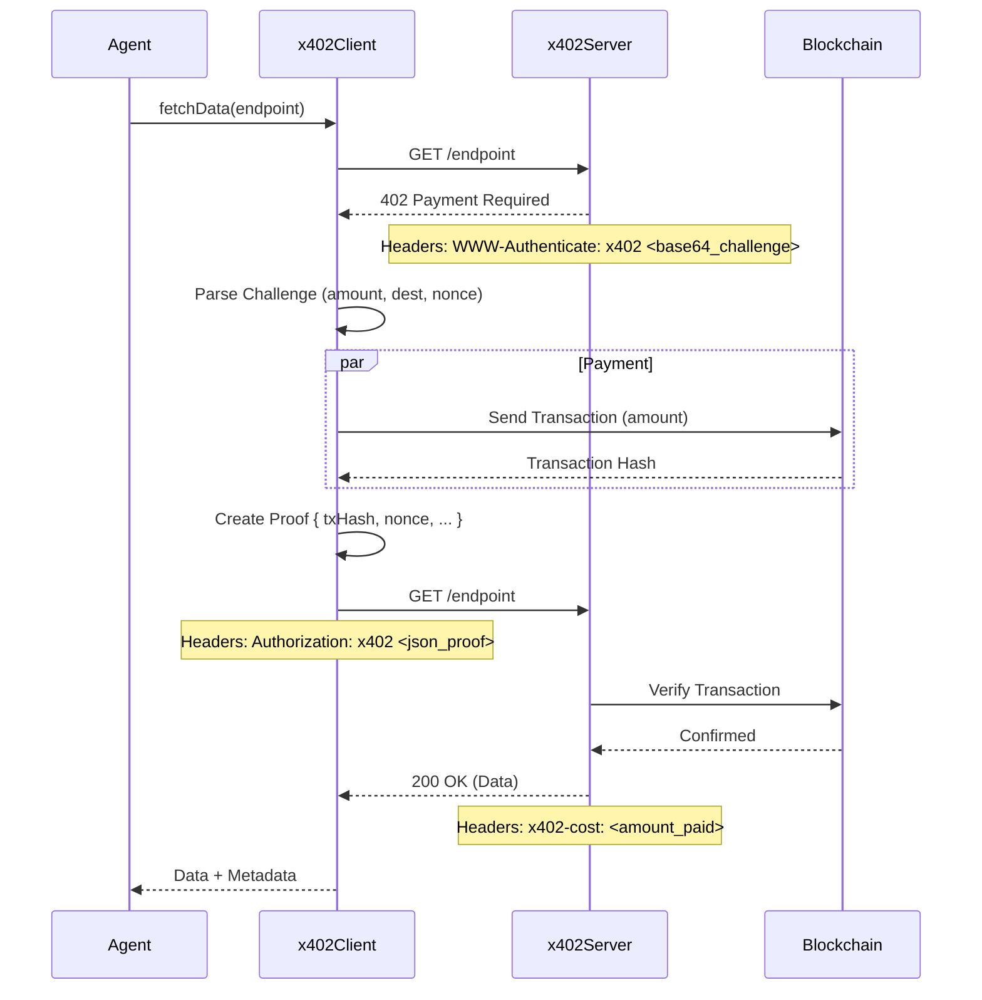

# x402 Architecture: Payment-Gated Agent Data

This document outlines the architecture for the **x402** protocol implementation in Ayin, enabling agents to pay for premium data using standard HTTP status codes and headers.

## Overview

The standard follows a simple **Challenge-Response** flow:
1.  **Request:** Client requests a resource.
2.  **Challenge:** Server responds with `402 Payment Required` and a challenge (payment details).
3.  **Payment:** Client executes payment (or generates proof).
4.  **Response:** Client retries request with `Authorization: x402 <proof>`.
5.  **Access:** Server validates proof and returns data.

## Protocol Flow



## Data Structures

### Payment Challenge (Server -> Client)

Sent in `WWW-Authenticate` header (Base64 encoded JSON):

```typescript
interface PaymentChallenge {
  paymentAddress: string;  // Where specific payment should go
  amount: string;          // Amount in wei
  token: string;           // Token address (0x0 for native)
  nonce: string;           // Unique challenge ID
  expiresAt: number;       // Timestamp
}
```

### Payment Proof (Client -> Server)

Sent in `Authorization` header (JSON):

```typescript
interface PaymentProof {
  transactionHash: string; // On-chain tx hash
  amount: string;          // Amount paid
  nonce: string;           // Challenge nonce matched
  agentId: number;         // Paying agent
}
```

## Security & Trust

1.  **Nonce Protection:** Challenges expire and nonces must match to prevent replay attacks.
2.  **On-Chain Verification:** The server (trust root) verifies on-chain that the transaction:
    *   Was successful.
    *   Sent the correct amount.
    *   Sent to the correct address.
    *   Is recent (block number check).

## Components

### 1. x402Client (`ayin-agent`)
*   Wraps `fetch` to handle 402 retries automatically.
*   Manages payment wallet and signing.
*   Logs costs for agent accounting.

### 2. x402Server (`ayin-x402-server`)
*   Middleware for Express.
*   Generates challenges.
*   Verifies proofs via `PaymentProvider`.
*   Logs usage for admin/analytics.

## Future Extensions

*   **Payment Channels:** For high-frequency low-latency data access.
*   **Subscription NFTs:** Checking `balanceOf` instead of per-request payment.
*   **Decentralized Gateway:** Running the server logic in a smart contract or trusted enclave.
